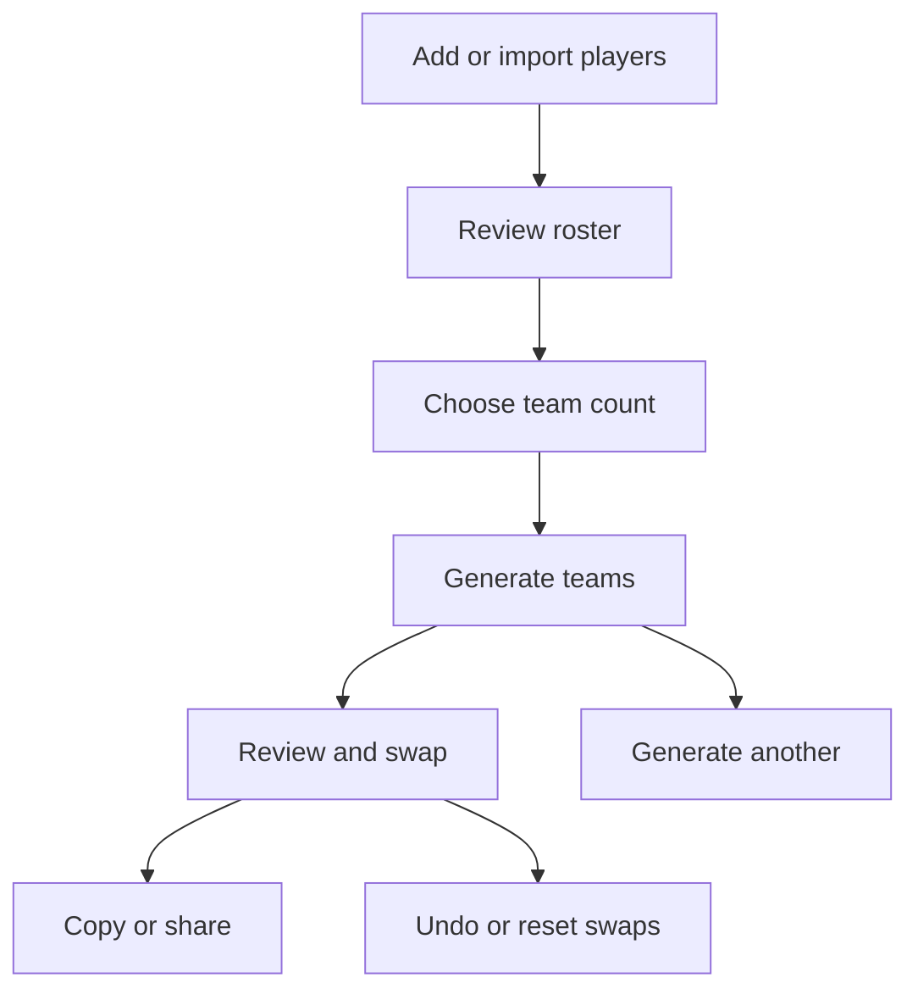

# QTeam: Product Flow and Technical Plan

## 1. Product definition

QTeam is a browser-based tool that turns a list of outfield football players into positionally balanced teams.

The user controls:

- The players in the roster
- The positions each player can play
- The number of teams
- Any manual swaps after generation

QTeam controls:

- The size of each team
- Each player's assigned position
- The positional shape of each team
- How flexible and scarce-position players are distributed

The central product rule is:

> Every player plays. The user chooses the number of teams; QTeam determines the fairest available team sizes, positional assignments, and formations.

QTeam balances positional coverage, not player skill. Skill-based balancing is outside the first release because the application has no skill data.

## 2. Platform and constraints

QTeam will be built with:

- Svelte 5
- SvelteKit
- Tailwind CSS
- `@sveltejs/adapter-static`
- GitHub Pages

The application has no backend and no user accounts. Parsing, team generation, persistence, and sharing all happen in the browser.

Consequences:

- Player data never needs to leave the user's device.
- The application must not depend on an API to generate teams.
- Refreshing or closing the tab must not destroy unfinished work.
- All browser APIs must be accessed safely after the application mounts; build-time rendering must not attempt to access `window` or `localStorage`.
- GitHub Pages must be configured with the correct SvelteKit `base` path when deployed beneath a repository path.

## 3. Finished user flow



The application has three primary screens and one secondary settings view:

1. **Players**
2. **Team setup**
3. **Teams**
4. **Position settings**

Navigation to later screens is allowed only when their prerequisites are valid.

## 4. Screen 1: Players

The Players screen supports importing a list and adding players manually. Both methods populate the same roster.

The screen must state:

> QTeam does not include goalkeepers. Add only outfield players.

### 4.1 Import a player list

The primary supported format is Qball's copied-player format:

```text
1. Anuv Love - Forward
2. Oluwaseun Aladeyelu - Defender
3. Femi - Defender, Midfielder, Forward
```

Unnumbered lines are also accepted:

```text
Anuv Love - Forward
Oluwaseun Aladeyelu - DF
Femi - Midfielder, Forward
```

For each non-empty line, the parser:

1. Removes optional leading numbering such as `1.`, `1)` or `1 -`.
2. Splits on the final spaced hyphen, ` - `.
3. Treats the trimmed left side as the player's name.
4. Splits the right side on commas.
5. Trims and case-folds each position token.
6. Maps recognised tokens to the canonical positions.
7. Reports unrecognised tokens and missing names or positions.

Splitting on the final ` - ` preserves hyphens within names where possible. Text within the name is never interpreted as a position. For example, `muhammed CM - Midfielder` retains `muhammed CM` as the name.

The parser must not:

- Guess a position
- Silently default a player to Midfielder
- Discard a valid player because another line is invalid
- Merge players merely because their names match

Duplicate names are allowed because two different players may have the same name. Internally, players are identified by generated IDs.

After parsing, the user sees:

- How many lines were imported successfully
- Which lines require correction
- The original line number for each error
- A preview before the imported players are added to the roster

Adding an import to a non-empty roster appends to the roster. It does not replace existing players without an explicit confirmation.

### 4.2 Add a player manually

The manual form contains:

- Player name
- Defender toggle
- Midfielder toggle
- Forward toggle
- Add player action

The name is trimmed before storage. A player must have a non-empty name and at least one eligible position.

### 4.3 Review and edit the roster

Each roster row shows:

- Player name
- Defender, Midfielder, and Forward position chips
- Edit-name action
- Remove action
- Validation warning when no position is selected

Position chips are editable in place.

The roster summary shows:

- Total players
- Players eligible as defenders
- Players eligible as midfielders
- Players eligible as forwards
- Flexible players, meaning players with more than one eligible position

Position totals overlap by design.

### 4.4 Continue conditions

The user can continue when:

- The roster contains at least eight players.
- Every player has a non-empty name.
- Every player has at least one eligible position.

Eight is the minimum because QTeam requires at least two teams with at least four outfield players each.

Changing the roster after teams have been generated makes the existing result stale. QTeam must clearly discard the generated result after confirmation or mark it unusable until the teams are regenerated. It must never display a result that silently omits a newly added player or retains a deleted player.

## 5. Position settings

QTeam supports exactly three canonical positions:

```ts
type Position = 'DEFENDER' | 'MIDFIELDER' | 'FORWARD';
```

Users can configure the tokens recognised during import.

| Canonical position | Default tokens |
|---|---|
| Defender | `Defender`, `Defence`, `Def`, `DF`, `D` |
| Midfielder | `Midfielder`, `Midfield`, `Mid`, `MF`, `M`, `CM` |
| Forward | `Forward`, `Attack`, `Attacker`, `FW`, `F`, `ST`, `CF` |

Token matching is:

- Case-insensitive
- Based on the complete trimmed token
- Applied only to the position part of an imported line

A normalised token cannot belong to more than one canonical position. Saving ambiguous settings is blocked with an error identifying the duplicated token.

Changing tokens does not silently rewrite the current roster. If an import is still available in the current editing session, QTeam may offer to parse it again and must show a preview before replacing any corrections.

The settings view provides separate actions for:

- Reset position tokens to defaults
- Clear the current QTeam workspace
- Clear all QTeam data, including preferences

## 6. Screen 2: Team setup

The user selects only the number of teams. Team sizes and formations are automatic.

### 6.1 Calculating team sizes

For `playerCount` players and `teamCount` teams:

```ts
const baseSize = Math.floor(playerCount / teamCount);
const largerTeamCount = playerCount % teamCount;

const teamSizes = Array.from(
  { length: teamCount },
  (_, index) => baseSize + (index < largerTeamCount ? 1 : 0)
);
```

This assigns every player and ensures that team sizes differ by at most one.

For 31 players across four teams, the result is:

```text
8, 8, 8, 7
```

There are no substitutes.

### 6.2 Valid team counts

A team count is valid when:

```text
teamCount >= 2
smallest calculated team size >= 4
largest calculated team size <= 10
```

The interface shows only valid options. It does not present invalid choices and wait for the user to discover the error.

For 32 players:

| Teams | Calculated sizes | Available |
|---:|---|---|
| 2 | 16, 16 | No |
| 3 | 11, 11, 10 | No |
| 4 | 8, 8, 8, 8 | Yes |
| 5 | 7, 7, 6, 6, 6 | Yes |
| 6 | 6, 6, 5, 5, 5, 5 | Yes |
| 7 | 5, 5, 5, 5, 4, 4, 4 | Yes |
| 8 | 4, 4, 4, 4, 4, 4, 4, 4 | Yes |
| 9 | At least one team has fewer than 4 | No |

The selected option previews the result:

```text
4 teams

3 teams will have 8 players.
1 team will have 7 players.

Goalkeepers are not included.
```

If a roster has no valid team count, the setup screen explains how many players must be added or removed to create teams within the supported range.

## 7. Team-generation engine

The generator must be a pure domain module. It must not read from Svelte stores, manipulate the DOM, call `localStorage`, or call `Math.random()` directly.

Suggested public contract:

```ts
type GenerateTeamsInput = {
  players: Player[];
  teamCount: number;
  seed: string;
};

type GenerateTeamsResult =
  | {
      ok: true;
      seed: string;
      teams: GeneratedTeam[];
      warnings: CoverageWarning[];
      score: BalanceScore;
    }
  | {
      ok: false;
      reason: 'INVALID_ROSTER' | 'INVALID_TEAM_COUNT';
      issues: ValidationIssue[];
    };
```

Passing a seed makes generation reproducible. The same valid input and seed must always produce the same result. “Generate another” creates a new seed and runs the same algorithm again.

### 7.1 Hard invariants

Every successful result must satisfy all of these:

1. Every input player appears exactly once.
2. No unknown player appears.
3. The number of generated teams equals the requested number.
4. Every team's size equals its calculated capacity.
5. The largest and smallest teams differ by at most one player.
6. Each player's assigned position is one of that player's eligible positions.
7. Every team formation equals its actual defender, midfielder, and forward counts.

These are correctness rules. The generator may never violate them to improve balance.

### 7.2 Balance objectives

After satisfying the hard invariants, candidates are compared using the following ordered objectives:

1. Maximise the number of teams with at least one defender, midfielder, and forward, where the roster makes this possible.
2. Minimise positional-count differences between equal-sized teams.
3. Minimise positional-ratio differences between unequal-sized teams.
4. Distribute players who cover scarce positions across teams.
5. Distribute highly flexible players across teams.
6. Prefer familiar formations when that does not worsen a higher-priority objective.
7. Use the seed to choose between equally scored results.

This order must be encoded explicitly rather than collapsed into unexplained magic numbers.

A suitable score shape is:

```ts
type BalanceScore = {
  teamsMissingCoverage: number;
  equalSizePositionVariance: number;
  crossSizeRatioVariance: number;
  scarcePlayerConcentration: number;
  flexiblePlayerConcentration: number;
  unfamiliarFormationPenalty: number;
  tieBreaker: number;
};
```

Scores are compared lexicographically in the order shown. Lower is better. This prevents a cosmetic preference for `3-3-2`, for example, from outweighing the more important need to give every team a defender.

### 7.3 Formation catalogue

The catalogue is an internal preference, not a user-controlled constraint.

```ts
const preferredFormations: Record<number, Formation[]> = {
  4: [[1, 2, 1], [2, 1, 1]],
  5: [[2, 2, 1], [1, 2, 2]],
  6: [[2, 2, 2], [2, 3, 1], [3, 2, 1]],
  7: [[2, 3, 2], [3, 2, 2], [3, 3, 1]],
  8: [[3, 3, 2], [3, 2, 3], [2, 3, 3]],
  9: [[3, 3, 3], [4, 3, 2], [3, 4, 2]],
  10: [[4, 3, 3], [3, 4, 3], [4, 4, 2]]
};
```

A formation is `[defenders, midfielders, forwards]`.

The generator may produce a custom shape when the roster cannot support a preferred formation. A weak but valid roster must still generate teams. For example, if there are very few defenders, `1-4-2` may be the honest best shape for a seven-player team.

### 7.4 Recommended implementation

Keep validation, candidate generation, scoring, and result formatting separate:

```text
validate input
  -> calculate capacities
  -> construct valid assignments
  -> improve assignments through moves/swaps
  -> score candidates
  -> choose the best candidate
  -> derive formations and warnings
```

For the first complete generator:

1. Sort players by positional scarcity: players with one eligible position first, then two, then three.
2. Use the seeded random source to vary order only within equally constrained groups.
3. Assign each player to the team-position option that produces the best current lexicographic score without exceeding team capacity.
4. Run a bounded improvement pass that evaluates cross-team swaps and eligible assigned-position changes.
5. Stop when a complete pass makes no improvement or the configured iteration limit is reached.
6. Keep the best valid result seen throughout the run.

This approach is understandable and testable. If later evidence shows poor outputs, the pure module can be replaced by a min-cost-flow or constraint-solver implementation without changing the UI or stored data contracts.

Do not describe a heuristic result as the mathematically optimal solution. In product copy, call it the “best generated balance,” not a proven global optimum.

### 7.5 Coverage warnings

Generation succeeds even when positional coverage is weak.

Example warnings:

```text
Team C has no assigned defender.
Only two defenders were available for four teams.
```

Warnings must be derived from the generated result and roster facts. They are not generic messages and do not make the result invalid.

## 8. Screen 3: Generated teams

Each team card shows:

- Editable team name
- Player count
- Automatically determined formation
- Players grouped by assigned position
- Copy-team action

Example:

```text
TEAM A — 3-3-2
8 players

DEFENDERS
Anuv Love
Mark
Tema

MIDFIELDERS
Femi
Henry
Mayor

FORWARDS
Teslim
Jet Victor
```

Unequal team sizes may have different formations.

### 8.1 Swapping players

Swaps are one-for-one between different teams, so team sizes remain valid.

Mobile flow:

1. Tap a player.
2. Tap a player on another team.
3. Preview the effect.
4. Confirm or cancel.

Desktop may also support drag-and-drop, but drag-and-drop must call the same swap domain function as the tap interaction.

After a proposed swap, QTeam recalculates assigned positions for both affected teams. A flexible player changing teams may allow several players on those teams to take different assigned positions.

The swap preview shows any degradation, such as:

```text
This swap would leave Team B without an assigned defender.
```

The user may confirm a positionally worse swap. Manual control is allowed, but the result remains structurally valid.

Suggested contract:

```ts
type PreviewSwapInput = {
  workspace: GeneratedWorkspace;
  firstPlayerId: string;
  secondPlayerId: string;
};

type SwapPreview = {
  before: BalanceScore;
  after: BalanceScore;
  affectedTeams: GeneratedTeam[];
  warningsAdded: CoverageWarning[];
  warningsRemoved: CoverageWarning[];
};
```

The teams screen supports:

- Undo last swap
- Reset all manual swaps to the generated baseline
- Generate another arrangement
- Rename a team

For the initial release, undo may be limited to the most recent swap. The persisted model leaves room for a larger undo stack later.

### 8.2 Copy and share

The result screen supports:

- Copy all teams
- Copy one team
- Share all teams with the Web Share API when supported

Example:

```text
TEAM A — 3-3-2

Defenders
1. Anuv Love
2. Mark
3. Tema

Midfielders
4. Femi
5. Henry
6. Mayor

Forwards
7. Teslim
8. Jet Victor
```

If `navigator.share` is unavailable or rejects the share, the copy action remains available. Cancelling the native share dialog is not displayed as an application error.

Output formatting is implemented as a pure function and tested independently from the Clipboard and Web Share APIs.

## 9. Domain data model

```ts
type Position = 'DEFENDER' | 'MIDFIELDER' | 'FORWARD';

type Player = {
  id: string;
  name: string;
  eligiblePositions: Position[];
};

type PositionTokens = Record<Position, string[]>;

type AssignedPlayer = {
  playerId: string;
  assignedPosition: Position;
};

type Formation = [defenders: number, midfielders: number, forwards: number];

type GeneratedTeam = {
  id: string;
  name: string;
  capacity: number;
  formation: Formation;
  players: AssignedPlayer[];
};

type CoverageWarning = {
  code:
    | 'NO_DEFENDER'
    | 'NO_MIDFIELDER'
    | 'NO_FORWARD'
    | 'INSUFFICIENT_POSITION_COVERAGE';
  teamId?: string;
  position?: Position;
  message: string;
};

type GeneratedWorkspace = {
  generationId: string;
  seed: string;
  rosterFingerprint: string;
  baselineTeams: GeneratedTeam[];
  currentTeams: GeneratedTeam[];
  warnings: CoverageWarning[];
  score: BalanceScore;
  lastSwap?: {
    firstPlayerId: string;
    secondPlayerId: string;
    previousTeams: GeneratedTeam[];
  };
};
```

Generated teams refer to players by ID rather than copying their names and eligible positions. The roster remains the source of truth and avoids stale duplicated player data.

`rosterFingerprint` is a stable hash of the player IDs, names, and sorted eligible positions. It allows the application to detect a generated result that does not belong to the current roster.

## 10. Browser persistence

Yes: QTeam should use `localStorage` and JSON for the first release.

Use two keys:

```text
qteam.workspace.v1
qteam.preferences.v1
```

Separating them allows **Start over** to clear the current roster and generated teams while preserving the user's import-token preferences.

### 10.1 Workspace JSON

```json
{
  "schemaVersion": 1,
  "updatedAt": "2026-07-30T12:30:00.000Z",
  "screen": "teams",
  "roster": [
    {
      "id": "0198-player-1",
      "name": "Femi",
      "eligiblePositions": ["DEFENDER", "MIDFIELDER", "FORWARD"]
    },
    {
      "id": "0198-player-2",
      "name": "Henry",
      "eligiblePositions": ["DEFENDER", "MIDFIELDER"]
    }
  ],
  "teamSetup": {
    "teamCount": 4
  },
  "generated": {
    "generationId": "0198-generation-1",
    "seed": "3f96bbf8",
    "rosterFingerprint": "v1:99e40f...",
    "baselineTeams": [
      {
        "id": "team-a",
        "name": "Team A",
        "capacity": 8,
        "formation": [3, 3, 2],
        "players": [
          {
            "playerId": "0198-player-1",
            "assignedPosition": "MIDFIELDER"
          }
        ]
      }
    ],
    "currentTeams": [
      {
        "id": "team-a",
        "name": "Team A",
        "capacity": 8,
        "formation": [3, 3, 2],
        "players": [
          {
            "playerId": "0198-player-1",
            "assignedPosition": "MIDFIELDER"
          }
        ]
      }
    ],
    "warnings": [],
    "score": {
      "teamsMissingCoverage": 0,
      "equalSizePositionVariance": 0,
      "crossSizeRatioVariance": 0,
      "scarcePlayerConcentration": 0,
      "flexiblePlayerConcentration": 0,
      "unfamiliarFormationPenalty": 0,
      "tieBreaker": 0.183
    }
  }
}
```

The example abbreviates the team arrays. Real persisted generated data must contain every team and every player assignment.

### 10.2 Preferences JSON

```json
{
  "schemaVersion": 1,
  "updatedAt": "2026-07-30T12:00:00.000Z",
  "positionTokens": {
    "DEFENDER": ["Defender", "Defence", "Def", "DF", "D"],
    "MIDFIELDER": ["Midfielder", "Midfield", "Mid", "MF", "M", "CM"],
    "FORWARD": ["Forward", "Attack", "Attacker", "FW", "F", "ST", "CF"]
  }
}
```

### 10.3 Persistence rules

- Validate parsed JSON at runtime before placing it in application state.
- Treat storage as untrusted input; TypeScript types alone do not validate stored data.
- Use a runtime schema library such as Zod, or a small explicit decoder if avoiding the dependency.
- If a document is malformed, preserve the other valid document and fall back only for the broken one.
- If the schema version is older, run an explicit migration.
- If the schema version is newer than the application understands, do not guess. Ignore it safely and offer to clear the incompatible saved data.
- Debounce ordinary writes, but flush immediately after important actions such as generation, a confirmed swap, and “Start over.”
- Catch quota and privacy-mode errors. A persistence failure must not crash the running application.
- Do not persist temporary UI details such as open menus, toast messages, hovered players, or an unconfirmed swap.
- Do not persist the raw imported text after the user accepts the parsed roster unless there is a demonstrated product need.

`localStorage` is sufficient because the expected data is small and the app has no cross-device or collaboration requirement. IndexedDB would add complexity without solving a current problem.

## 11. Suggested code boundaries

```text
src/lib/domain/
  players.ts
  positions.ts
  team-counts.ts
  formations.ts
  generator.ts
  scoring.ts
  swaps.ts
  sharing.ts
  validation.ts

src/lib/persistence/
  schemas.ts
  migrations.ts
  storage.ts

src/lib/state/
  workspace.svelte.ts
  preferences.svelte.ts

src/lib/components/
  players/
  setup/
  teams/
  settings/

src/routes/
  +layout.svelte
  +page.svelte
  setup/+page.svelte
  teams/+page.svelte
```

Domain functions are pure and framework-independent. Svelte components coordinate input and presentation; they do not contain parsing or balancing logic.

For GitHub Pages, direct navigation to nested routes needs deliberate handling. The simplest reliable first version is a single SvelteKit route with internal flow state. If separate routes are used, configure static fallback behaviour and verify direct reloads on the deployed Pages URL.

## 12. Test strategy

Tests cannot prove that the entire application has no bugs. They can guarantee the explicit invariants for every generated case they exercise and make regressions in agreed behaviour difficult to introduce.

Use three layers:

- **Vitest** for pure unit tests
- **fast-check** for property-based generator tests
- **Playwright** for browser workflows
- **Testing Library for Svelte** only where component-level interaction tests add value beyond the Playwright flows

Most tests should target the pure domain modules. Do not try to establish algorithm correctness primarily through DOM snapshots.

### 12.1 Parser tests

Test:

- Numbered Qball lines
- Unnumbered lines
- Multiple eligible positions
- All configured aliases
- Mixed casing and surrounding whitespace
- Blank lines
- Names containing hyphens
- Names containing position-like text such as `muhammed CM`
- Duplicate player names receiving distinct IDs
- Missing names
- Missing separators
- Missing positions
- Unknown positions
- A mixture of valid and invalid lines
- Ambiguous token settings being rejected
- No silent fallback position

Prefer direct assertions on parsed values and structured errors over large snapshots.

### 12.2 Team-count tests

Use table-driven tests for boundaries and representative values:

```ts
[
  { players: 8, teams: 2, sizes: [4, 4], valid: true },
  { players: 31, teams: 4, sizes: [8, 8, 8, 7], valid: true },
  { players: 32, teams: 3, sizes: [11, 11, 10], valid: false },
  { players: 32, teams: 8, sizes: [4, 4, 4, 4, 4, 4, 4, 4], valid: true },
  { players: 32, teams: 9, sizes: [4, 4, 4, 4, 4, 3, 3, 3, 3], valid: false }
]
```

Property tests should establish:

- The sizes sum to the player count.
- The number of sizes equals the team count.
- The maximum and minimum differ by no more than one.
- A returned valid option has every size between 4 and 10.
- Every team count reported as available passes the same validator used by generation.

### 12.3 Generator invariant tests

Generate hundreds or thousands of random valid rosters with:

- 8 or more players
- All seven non-empty combinations of eligible positions
- Every valid team count for the roster
- Random deterministic seeds

For every successful result, assert all hard invariants:

```ts
expect(allAssignedIds).toHaveLength(players.length);
expect(new Set(allAssignedIds).size).toBe(players.length);
expect(new Set(allAssignedIds)).toEqual(new Set(players.map(p => p.id)));
```

Also assert:

- Every assigned position belongs to the relevant player's eligible positions.
- Team capacities match calculated sizes.
- Formation counts match actual assignments.
- The same seed and input produce deep-equal results.
- Different seeds can produce different results for a roster with equivalent solutions.
- The input arrays and player objects were not mutated.
- Generation finishes within an agreed budget for the largest supported fixture.

### 12.4 Balance-quality fixtures

Property tests establish validity; carefully designed fixtures establish expected quality.

Include named fixtures for:

- A perfectly balanced single-position roster
- A roster made entirely of flexible players
- Too few defenders for the number of teams
- Exactly one eligible defender per team
- Unequal team sizes
- A roster dominated by one position
- A roster where using flexible players correctly gives every team full coverage
- Duplicate player names

For these fixtures, assert meaningful outcomes rather than exact full team membership unless membership itself is the behaviour under test.

Good:

```ts
expect(result.teams.every(hasAllThreePositions)).toBe(true);
```

Fragile:

```ts
expect(result.teams[0].players[0].playerId).toBe('femi');
```

Use exact-result assertions only for seeded determinism tests.

### 12.5 Swap tests

Test:

- Players in different teams can be swapped.
- Players in the same team are rejected.
- An unknown player ID is rejected.
- Team sizes remain unchanged.
- Every player still appears exactly once.
- Assigned positions remain eligible.
- Formations are recalculated.
- New and removed warnings are reported.
- A worse swap can be previewed and confirmed.
- Cancelled swaps make no changes.
- Undo restores the exact previous teams.
- Reset restores the generated baseline.
- Swaps do not mutate the baseline.

Run the generator invariant assertion helper against every successful post-swap state.

### 12.6 Persistence tests

Test:

- A valid workspace round-trips through JSON.
- Valid preferences round-trip through JSON.
- Missing keys load defaults.
- Invalid JSON does not crash the app.
- Invalid enum values are rejected.
- Duplicate player IDs are rejected.
- A generated result with the wrong roster fingerprint is discarded.
- A supported old schema migrates correctly.
- A future schema version is not read as current data.
- Clearing the workspace preserves preferences.
- Clearing all data removes both documents.
- A quota error leaves the in-memory application usable.
- Browser-only storage code is not executed during the static build.

### 12.7 Sharing tests

Test the formatter with:

- One team
- Several teams
- Unequal team sizes
- Custom team names
- Custom formations
- Duplicate player names
- All three position headings

Browser tests cover:

- Copy all teams
- Copy one team
- Share shown only when supported
- Native share cancellation handled silently
- Clipboard failure shown as a recoverable error

### 12.8 End-to-end acceptance journeys

At minimum, Playwright covers:

1. Import the sample Qball list, correct an invalid token, choose four teams, generate, and copy all teams.
2. Add eight players manually, generate two teams, reload, and verify the result is restored.
3. Generate teams, preview and confirm a swap, undo it, and reset to the baseline.
4. Change position tokens, reload, and import a list using the new aliases.
5. Start over and verify that the roster/result are cleared while position tokens remain.
6. Load the deployed application beneath its GitHub Pages base path and complete the primary flow.

## 13. Test-writing rules

- Test behaviour and invariants, not private implementation details.
- Give tests names that describe the rule and expected result.
- Keep fixtures small unless size is the subject of the test.
- Centralise reusable invariant assertions.
- Use deterministic seeds in all repeatable tests.
- Print the seed when a property test fails so the case can be replayed.
- Do not use snapshots for generated teams or large JSON state.
- Every reported production bug must first be reproduced by a failing test.
- A version is not complete while tests are skipped or marked as expected failures.
- CI runs type checking, unit tests, property tests, the production build, and the essential Playwright journey.

Suggested CI commands:

```text
npm run check
npm run test:unit
npm run test:property
npm run build
npm run test:e2e
```

## 14. Versioned delivery plan

Each version should be deployable on GitHub Pages and independently testable. Do not build all screens before validating the domain rules.

### Version 0: Static foundation

Deliver:

- Svelte 5 and SvelteKit project
- Tailwind setup
- Static adapter and GitHub Pages base-path configuration
- Basic app shell and navigation
- CI pipeline
- Test harnesses for Vitest and Playwright

Acceptance:

- Production build succeeds.
- Deployed root URL loads.
- Direct reload behaviour matches the chosen single-route or fallback strategy.
- A smoke test passes against the built application.

### Version 1: Roster and import

Deliver:

- Manual player entry
- Qball-list parser
- Roster review and editing
- Position-token settings
- Roster summary
- Versioned workspace and preferences persistence
- Start-over behaviour

Tests:

- Parser unit tests
- Position-token validation tests
- Persistence and migration tests
- Player-screen component tests
- End-to-end import, correction, reload, and start-over journeys

Manual checkpoint:

- Paste real lists copied from Qball.
- Confirm that every name and position is interpreted correctly.
- Refresh halfway through editing and confirm nothing is lost.
- Change aliases and verify that existing corrected players are not silently rewritten.

### Version 2: Team sizes and valid setup

Deliver:

- Valid team-count calculation
- Automatic team-size preview
- Team setup screen
- Navigation guards when the roster is invalid
- Clear handling when no valid team count exists

Tests:

- Boundary tables for 4–10 players per team
- Property tests for capacity calculation
- Setup-screen interaction tests
- End-to-end roster-to-setup journey

Manual checkpoint:

- Try several real roster sizes, especially indivisible counts such as 25, 29, and 31.
- Confirm every available option assigns everyone and differs by at most one player.

### Version 3: Valid team generation

Deliver:

- Seeded generator
- Hard-invariant enforcement
- Assigned positions
- Derived formations
- Generated-team cards
- Coverage warnings
- Generate-another action

The first goal of this version is structural correctness. No player may disappear, appear twice, exceed a team capacity, or be assigned an ineligible position.

Tests:

- Generator property tests
- Seed determinism tests
- Named balance fixtures
- Performance budget test
- End-to-end generation and regeneration journey

Manual checkpoint:

- Generate teams repeatedly from several real Qball rosters.
- Review whether results are positionally credible.
- Record poor-but-valid outputs as fixtures before changing the scorer.

### Version 4: Balance refinement

Deliver:

- Scarcity-aware ordering
- Lexicographic balance scoring
- Bounded improvement through swaps and position reassignment
- Preferred-formation scoring
- Clear diagnostic information in development mode

Tests:

- Quality fixtures for awkward rosters
- Comparisons proving the refined scorer never chooses a candidate worse on a higher-priority objective
- Performance tests at the maximum intended roster size
- Regression fixtures from Version 3 manual testing

Manual checkpoint:

- Compare multiple seeded outputs for real rosters.
- Confirm that teams with equal sizes have comparable coverage.
- Confirm that a preferred formation is never chosen at the expense of a higher-priority balance rule.

### Version 5: Manual adjustment

Deliver:

- Tap-to-swap flow
- Optional desktop drag-and-drop
- Swap preview and coverage warning changes
- Recalculation of affected team positions
- Undo last swap
- Reset to generated baseline
- Persistence of confirmed swaps

Tests:

- Swap domain tests
- Invariant tests after swaps
- Interaction tests for tap and drag paths
- End-to-end preview, confirm, cancel, undo, reset, and reload journeys

Manual checkpoint:

- Complete swaps on both a narrow mobile viewport and desktop.
- Confirm there is no accidental swap while scrolling.
- Confirm reset and undo do exactly what their labels claim.

### Version 6: Sharing and release hardening

Deliver:

- Copy one team
- Copy all teams
- Web Share API integration
- Offline-capable static assets after first load, if deliberately enabled
- Accessibility and responsive-layout pass
- Storage failure handling
- Final GitHub Pages deployment workflow

Tests:

- Sharing formatter unit tests
- Clipboard and Web Share browser tests
- Keyboard-navigation checks
- Essential Playwright suite against the production build
- Deployment smoke test beneath the real repository base path

Manual checkpoint:

- Copy results into WhatsApp and verify readability.
- Test on a real mobile browser.
- Test refresh, offline reopening if supported, and a clean-browser first visit.

## 15. Definition of done

QTeam is ready for its first public release when:

- A real Qball list can be imported and corrected without data loss.
- Only valid team counts are offered.
- Every generated result satisfies all hard invariants.
- Awkward rosters generate honest warnings instead of failing.
- The same seed reproduces the same result.
- Manual swaps cannot corrupt membership or team sizes.
- Refresh restores the current workspace.
- Start over preserves position-token preferences.
- Copy output is readable in WhatsApp.
- The production static build works at its GitHub Pages URL.
- CI passes with no skipped required tests.

## 16. Explicit non-goals for the first release

- Goalkeepers
- Substitutes
- Skill ratings
- User-selected formations
- Accounts
- Cloud synchronisation
- Shared or collaborative editing
- Historical saved matches
- Integration with the Qball backend
- Claims of mathematically perfect or skill-balanced teams
